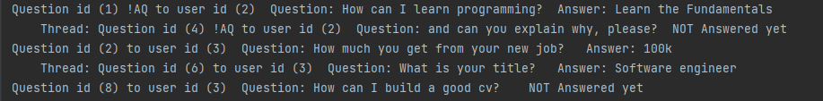
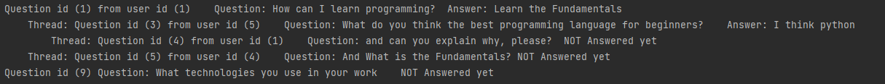
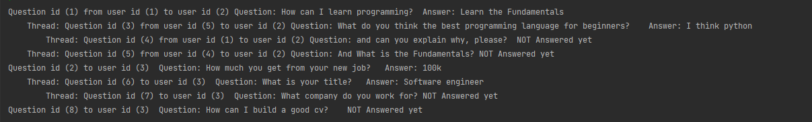

# Features
1. You can ask a question (anonymous or normal)
2. You can control whether you want to be asked anonymous questions or not when you sign up
3. You can ask in threads - no limit
4. You can see your questions either from or to you 
5. Answer a question and update your answer
6. Delete a question, this will delete all the threads on this question
7. Multiple users can use the program in the same time and see the updates in real time

# Notes
- Anonymous questions are the common so I will mark only the non anonymous questions (!AQ) when you print the questions from you  
- If a question is anonymous you can't see the user who asked it  

# Screenshots
## Get Questions From Me

## Get Questions To Me 

## List All Questions

